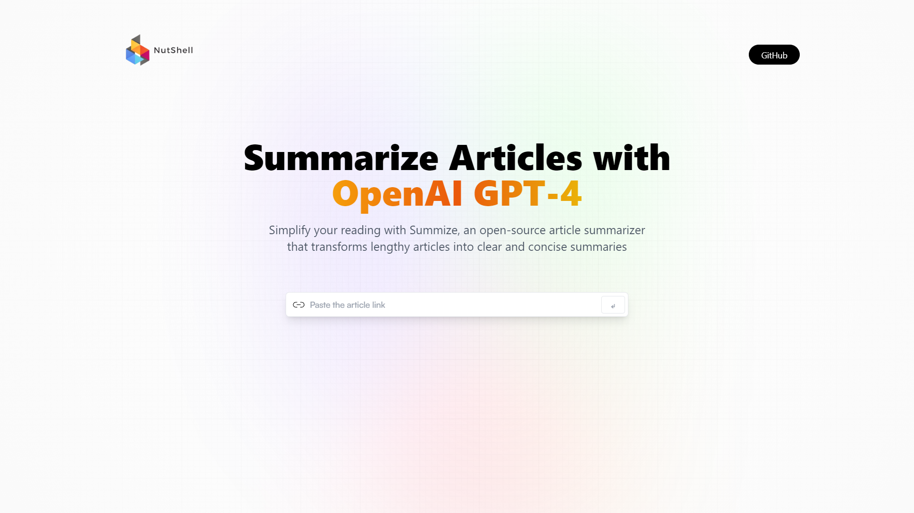
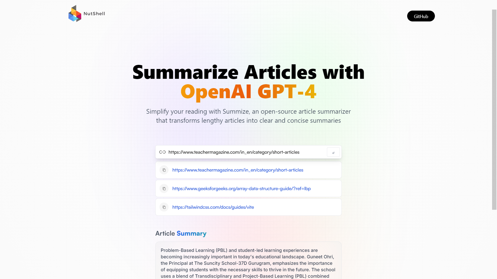
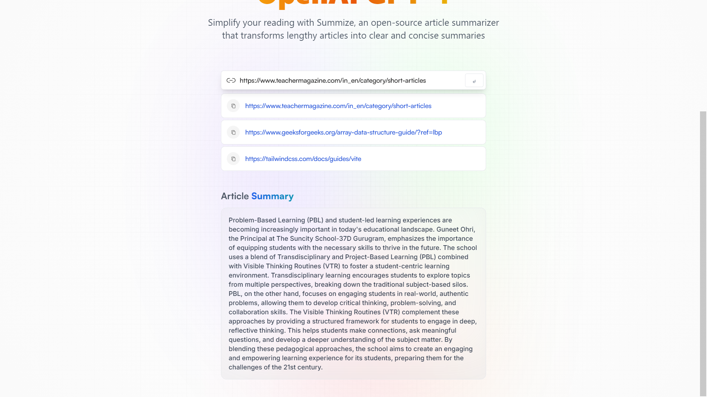

# NutShell - Get easy and concise summary of any article.

This is a summarizing platform on which you can provide link of article that you want to get summarized.

- NutShell - [Demo](https://nut-shell-gamma.vercel.app/)

- Screenshot - 

  <h2 style="margin-top:9px"; align="center">Home</home> 
  
  <h2 style="margin-top:9px"; align="center">Search History</home> 
  
  <h2 style="margin-top:9px"; align="center">Summary</home> 
  

